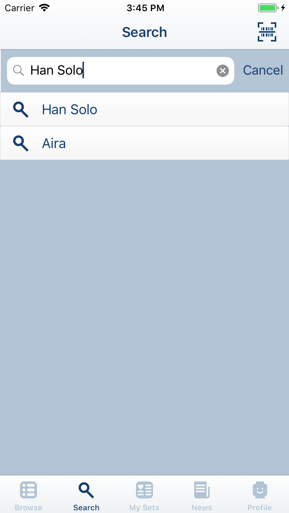
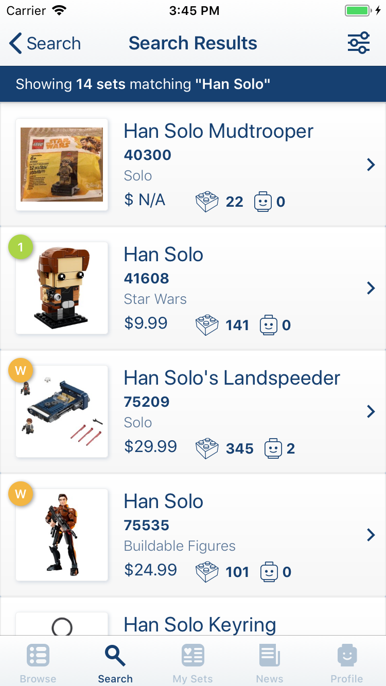
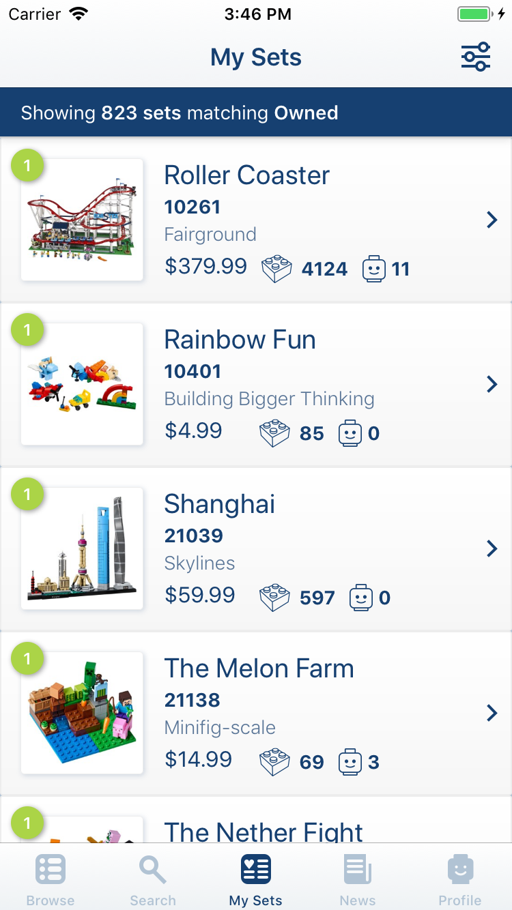
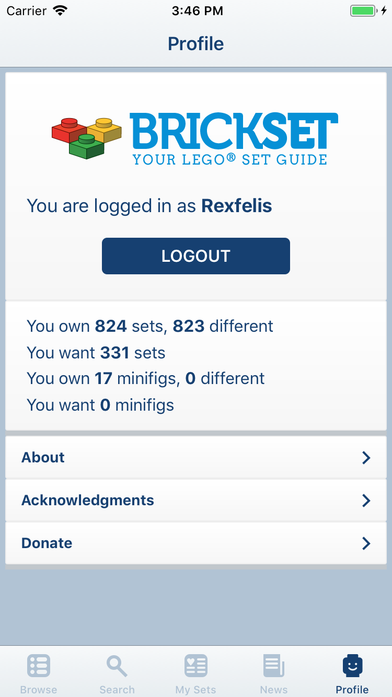
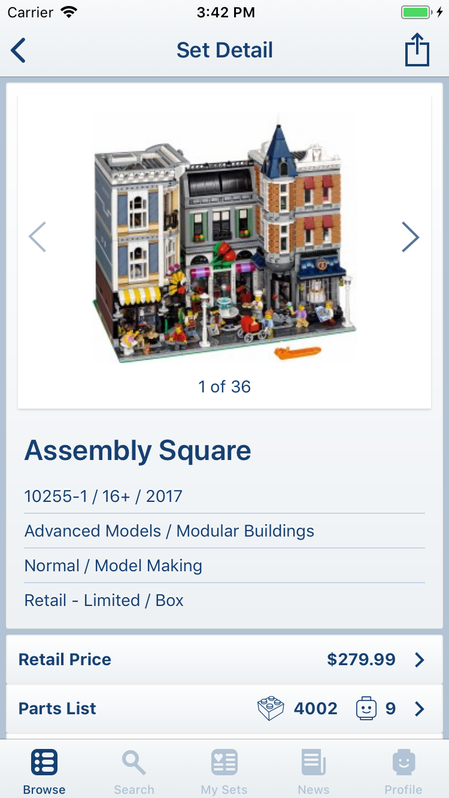

# MyBricks

Mobile (iOS) application for interacting with the BrickSet LEGO database.

* Browse the catalog of current and retired LEGO sets.
* Search for a specific set by number, name, or theme, or scan the barcode to look up the set details.
* Track the sets/minifigures you own or want using your Brickset.com account
* Read the latest news from Brickset.com

# Screenshots

## Browse

</img>
</img>
</img>

## Search

</img>
</img>
</img>

## My Sets

</img>

## News

</img>
</img>

## Profile

</img>

## Set Detail

</img>
</img>
</img>
</img>
</img>
</img>
</img>
</img>
</img>
</img>
</img>

# Getting Started

### Requirements

* Xcode 9.2 or greater (https://developer.apple.com/xcode/)
* CocoaPods 1.4.0 or greater (https://cocoapods.org)

### Building

* Clone the source to your local machine using `git clone <URL>` (repository URL can be copied from the 'Clone or Download' button above)
* Open a terminal and go to the directory where you cloned the source
* Install the required CocoaPods using `pod install`
* Open the project in Xcode - use the xcworkspace rather than xcodeproj, or you will get build errors from the CocoaPods dependencies not building
* Build and run using the Xcode Simulator

# To Do

- [x] Experiment with alternate (more compact) layout for Set Detail view
- [x] Implement display of set description in Set Detail view
- [x] Implement UPC/EAN scanning support
- [x] Implement search history
- [x] Implement support for instructions in Set Detail view
- [x] Implement support for parts list in Set Detail view
- [x] Implement owned/wanted updates on Set Detail view
- [x] View parts list for sets (using Rebrickable API)
- [x] Implement filtering on Sets List view
- [x] Implement filtering on My Sets view
- [ ] Implement filtering on Parts List view
- [ ] Add part detail view
- [ ] Add more detail to price information (new view with prices in all available currencies + current prices from Bricklink)
- [x] Implement support for additional images in Set Detail view
- [ ] Implement TouchID support for login
- [ ] Implement About/Credits views
- [x] Refactor Profile view to use table view cells
- [ ] Improved transition animation (zoom?) for displaying large set images
- [ ] Implement force touch actions on Set List view
- [ ] Implement force touch actions on Set Detail view

# Future Enhancements

* More Profile Information / Editing Profile (requires Brickset API changes)
* Local/offline storage of set data (using Core Data)
* iPad support, iPad specific layouts

# Credits

Application data graciously provided by **[Brickset](http://www.brickset.com)** using it's web services API.
Parts data provided by **[Rebrickable](http://rebrickable.com)** using it's web services API.

# Third Party Libraries/Frameworks

* **[Alamofire](https://github.com/Alamofire/Alamofire)** - Swift framework to simplify networking code
* **[AlamofireImage](https://github.com/Alamofire/AlamofireImage)** - Swift framework to simplify fetching/caching images
* **[AlamofireNetworkActivityIndicator](https://github.com/Alamofire/AlamofireNetworkActivityIndicator)** -
* **[AlamofireRSSParser](https://github.com/AdeptusAstartes/AlamofireRSSParser)** - Swift framework for parsing RSS feeds
* **[Fuzi](https://github.com/cezheng/Fuzi)** - Framework for parsing XML returned by the Brickset API
* **[Cosmos](https://github.com/evgenyneu/Cosmos)** - A handy configurable star/rating view
