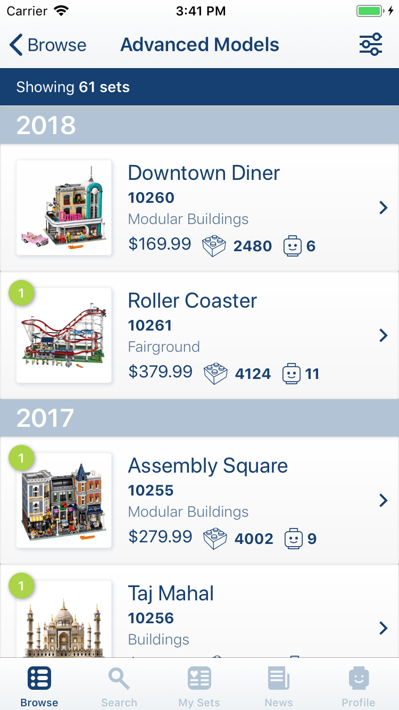
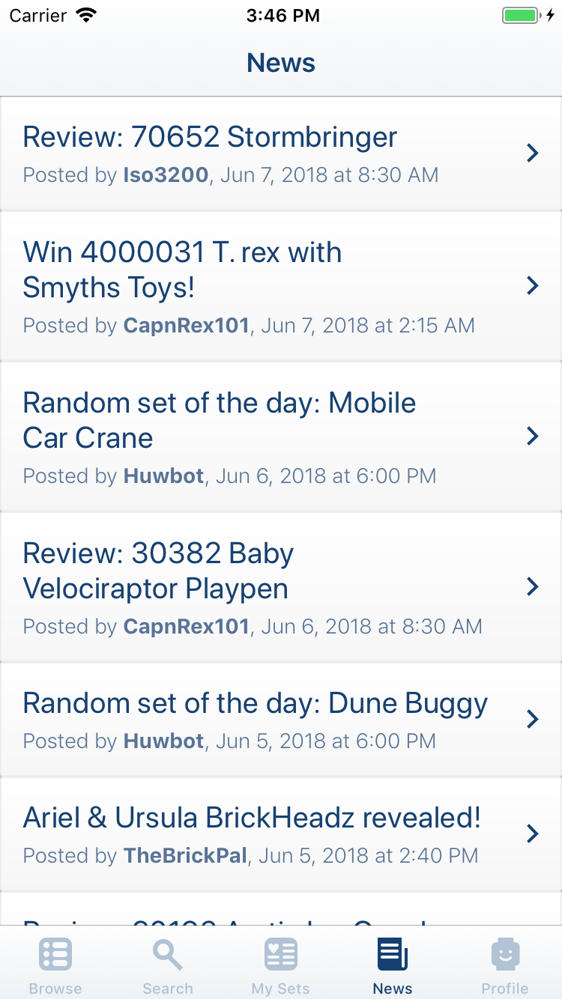
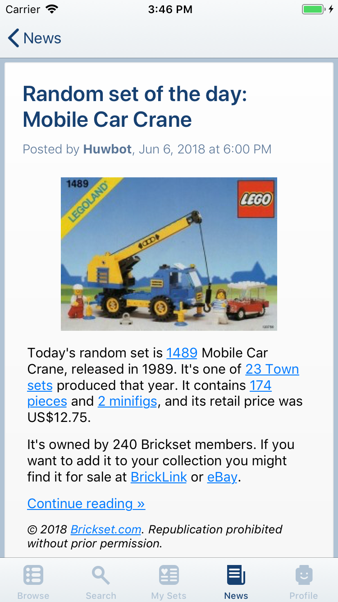

# MyBricks

Mobile (iOS) application for interacting with the BrickSet LEGO database.

# Screenshots

# Getting Started

### Requirements

* Xcode 9.1 or greater (https://developer.apple.com/xcode/)
* CocoaPods 5.0 or greater (https://cocoapods.org)

### Building

* Clone the source to your local machine using `git clone <URL>` (repository URL can be copied from the 'Clone or Download' button above)
* Open a terminal and go to the directory where you cloned the source
* Install the required CocoaPods using `pod install`
* Open the project in Xcode - use the xcworkspace rather than xcodeproj, or you will get build errors from the CocoaPods dependencies not building
* Build and run using the Xcode Simulator

# Future Enhancements

* local/offline storage of set data
* View parts list for sets (using Rebrickable API?)
* View set instructions
* iPad support, iPad specific layouts

# To Do

* Refactor Profile view to use table view cells?
* Experiment with alternate layout for Set Detail view
* Implement owned/wanted updates on Set Detail view
* Implement basic Search view
* Implement filtering on Sets List view
* Implement basic My Sets view
* Implement filter on My Sets view
* Implement force touch actions on Set List view?
* Implement support for additional images in Set Detail view
* Implement displat of set description in Set Detail view
* Implement TouchID support for login
* Implement About/Credits views
 
# Credits

Application data graciously provided by **[Brickset](http://www.brickset.com)** using it's web services API.

# Third Party Libraries/Frameworks

* **[Alamofire](https://github.com/Alamofire/Alamofire)** - Swift framework to simplify networking code
* **[AlamofireImage](https://github.com/Alamofire/AlamofireImage)** - Swift framework to simplify fetching/caching images
* **[AlamofireNetworkActivityIndicator](https://github.com/Alamofire/AlamofireNetworkActivityIndicator)** - 
* **[AlamofireRSSParser](https://github.com/AdeptusAstartes/AlamofireRSSParser)** - Swift framework for parsing RSS feeds
* **[Fuzi](https://github.com/cezheng/Fuzi)** - Framework for parsing XML returned by the Brickset API
* **[Cosmos](https://github.com/evgenyneu/Cosmos)** - A handy configurable star/rating view
